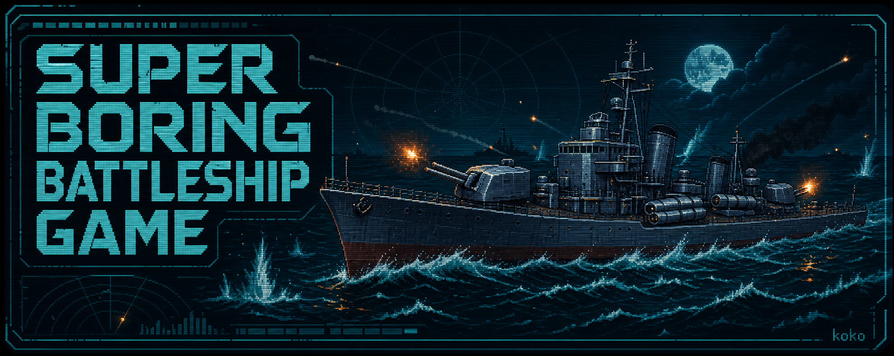

<p align="center">
  
</p>

[English](README.md) |
[简体中文](README.zh-CN.md) |
[繁體中文](README.zh-TW.md) |
[日本語](README.ja.md) |
[Español](README.es.md) |
[Deutsch](README.de.md) |
[Русский](README.ru.md)

# Super Boring Battleship Game

**Official Chinese title / 正式中文名：Game：超级无聊战舰游戏**

> A deliberately unhurried, lightweight 3D WWII naval-combat game by **koko**.
> 由 **koko** 制作的低配置二战 3D 海战游戏 / 由 **koko** 製作的低配備二戰 3D 海戰遊戲 / **koko** 制作の軽量な第二次大戦3D海戦ゲーム
> Combate naval 3D de la SGM para equipos modestos / Leichtgewichtiger 3D-Seekampf im Zweiten Weltkrieg / Лёгкая 3D-игра о морских боях Второй мировой

[Download the latest Windows build](https://github.com/Arsenic-er/Game-Super-Boring-Battleship/releases/latest) · Select a language above

## About the game

Super Boring Battleship Game is a lightweight naval combat prototype with single-player battles and two-player LAN co-op against AI. It focuses on readable ballistics, deliberate ship handling, modular damage and low-end-PC compatibility. It uses TypeScript, Babylon.js, Vite and Electron.

This is an early prototype rather than a finished commercial game. Visuals, balance, ship models and progression are still evolving.

## Current features

- Player-vs-AI battles tuned for a 15–20 minute normal duration, plus an unlimited sea-trials mode.
- Two-player LAN co-op against AI with room search, a copyable host IPv4/port fallback, saved-build selection, host-authoritative simulation and same-room rematches after results. See the [LAN guide](docs/LAN_MULTIPLAYER.md).
- Historically paced destroyer movement with gradual rudder shift, steering-damage response and speed loss during hard turns.
- Main-gun ballistics with visible shell arcs, dispersion, reload progress and independent turret alignment.
- Staged HE/AP loading with 21 mm HE penetration, probabilistic AP ricochet, fuse-based overpenetration and compartment saturation.
- Weapon slots: `1` main guns, `2` twin torpedo launch, `3` AI-controlled fleet aviation.
- RTS-style box selection, movement, guard, patrol, interception and surface-strike orders for AI-piloted squadrons; pilots select suitable guns, bombs or aerial torpedoes and resolve attacks without direct player control.
- Torpedo side arcs, narrow/wide spread, arming distance, per-model maximum range, lead prediction and closest-approach warnings.
- Four historical torpedo loadouts with distinct compressed gameplay trade-offs in speed, range, damage, reload, wake visibility and onboard risk.
- A visible traversing twin-tube launcher with alignment-gated firing, one loaded salvo plus two reserve salvos, and dynamic reload progress.
- A separately damageable torpedo-launcher module; partial damage slows traverse and reloading, while destruction halts both.
- A two-charge destroyer Smoke Generator that lays persistent puffs, breaks optical contact in both directions and exposes ships that fire main guns from smoke.
- A two-charge Hydroacoustic Search consumable that detects ships through smoke within 2 km and extends enemy-torpedo detection to 1.4 km.
- A shared multi-station 112 m Destroyer V2 used by both combat and dockyard views, with a stepped bridge, twin raked funnels, tripod mast, breakwater, lifeboats and standard component hardpoints.
- Hull compartments, module damage, fire, flooding, crew-dependent repair and recoverable health.
- Central objective A with capture progress, contested superiority, team scores and score victory.
- Non-omniscient AI optics with sampled noisy contacts, acquisition, target loss, search and reacquisition; firing requires a live track.
- Player HUD, aiming scope, 3D visibility and tactical maps use the same optical contacts; stale targets become fading last-known markers instead of live tracking.
- Physical ship collision and location-dependent collision damage.
- Automatic cruiser and battleship secondary batteries: every fitted historical mount keeps its own range, traverse, reload and dispersion, and fires only after two valid sensor samples.
- Tactical minimap and full map, dedicated aiming scope, developer diagnostics and adjustable sensitivity.
- Local captain profile with a non-cash Armory, research unlocks, transparent resource prices, free battle-earned supply tickets and deterministic direct procurement.
- A standalone warehouse for owned/installed counts, protected baseline equipment, duplicate sales and parts salvaging; the dockyard remains focused on fitting components.
- Portable Windows x64 build: extract the ZIP and launch the EXE; no installer is required.

## Controls

| Input | Action |
|---|---|
| `W` / `S` | Increase or reduce engine order |
| `A` / `D` | Rudder left / right |
| Mouse movement | Look around |
| Mouse wheel | Adjust aiming range |
| `R` | Enter / leave aiming scope |
| `1` / `2` / `3` | Main gun / torpedo / fleet aviation command slot |
| `Q` | Switch HE/AP for main guns; switch narrow/wide spread for torpedoes |
| `Space` | Fire selected weapon |
| `4` | Cycle balanced / firefighting / flooding / module repair priority |
| `H` | Hold to divert damage-control crew to recoverable hull damage |
| `E` | Activate Smoke Generator |
| `F` | Activate Hydroacoustic Search |
| `G` | Drop a depth-charge pattern (destroyers with ASW equipment) |
| `M` | Open / close tactical map |
| `F3` | Developer diagnostics |
| `Esc` | Exit scope/map or pause |

## Windows quick start

1. Open the repository's **Releases** page.
2. Download `battleship-0.7.0-windows-x64.exe`.
3. Double-click the portable EXE. No installation or extraction is required.

The build targets 64-bit Windows 10/11. Windows SmartScreen may warn about an unsigned indie build; only run a file downloaded from this repository's official Release page.

## Development

Requirements: Node.js 24.x and npm.

```bash
npm install
npm test
npm run build
```

Create the portable Windows executable:

```bash
npm run desktop:dist
```

Architecture notes and game-design documents are available in [`docs/`](docs/).

## Copyright and third-party software

The original game code and artwork are copyright © 2026 **Arsenic-er (koko)**. All rights reserved. No open-source license is granted at this stage.

Third-party libraries and the Fusion Pixel Font remain under their respective licenses. See [`THIRD_PARTY_NOTICES.md`](THIRD_PARTY_NOTICES.md).

---

# Game：超级无聊战舰游戏

> 由 **koko** 制作的、节奏刻意偏慢并照顾普通电脑配置的二战驱逐舰 3D 战斗原型。

[下载最新版 Windows 压缩包](https://github.com/Arsenic-er/Game-Super-Boring-Battleship/releases/latest) · [返回英文介绍](#super-boring-battleship-game)

## 游戏简介

《超级无聊战舰游戏》是一款支持单人战斗和双人局域网合作对抗 AI 的轻量海战原型，重点是可读的弹道、偏真实的舰船操纵、模块化损伤和低配置电脑兼容性。项目使用 TypeScript、Babylon.js、Vite 与 Electron 开发。

目前仍是早期原型，并非完成的商业游戏。画面、平衡、舰船模型和成长系统仍会继续修改。

## 当前内容

- 常规时长目标为 15–20 分钟的人机战斗，以及没有时间限制的舰船测试模式。
- 双人局域网合作对抗 AI：支持搜索房间、可复制的房主 IPv4/端口、保存配装选择、房主权威模拟，以及结算后保留房间直接重赛；配置与排障见[局域网联机指南](docs/LAN_MULTIPLAYER.md)。
- 中央 A 区占领、区域优势、双方积分与积分胜利。
- 非全知 AI 光学观测：目标测量有刷新间隔与误差，并包含识别、丢失、搜索和重获；没有实时跟踪时禁止开火。
- 玩家 HUD、瞄准镜、3D 敌舰可见性和战术地图遵循相同的光学接触；失联后只保留逐渐衰减的最后已知标记。
- 接近现实节奏的驱逐舰航速、车钟和舵机操纵；转向模块受损会减慢实际舵速，持续大舵角会损失航速。
- 可见炮弹轨迹、散布、装填进度、炮管实际指向与独立火控准线。
- 15 个舰级拥有 3.65–5.00 km 的独立有效主炮射程；HUD、船坞、AI、开火暴露和模拟核心读取同一数据。
- 每座主炮塔独立判断结构死角：射界内可在转正前按当前炮管方向开火，死角内不浪费炮弹和装填。
- HE/AP 弹药切换、装甲入射角、跳弹、碎弹、正常穿透与过度穿透。
- 弹种切换区分“当前已装填”和“待装填”；HE 固定穿深、AP 概率跳弹/引信过穿以及舱段饱和共同决定伤害。
- 武器栏：`1` 主炮、`2` 双雷齐射、`3` AI 自主作战的舰载航空兵指挥。
- 航空兵支持类似即时战略游戏的框选、移动、护卫、巡逻、截击和对舰攻击；机群会按角色选择机炮、炸弹或航空鱼雷并自行完成攻击。
- 鱼雷具有左右舷射界、窄/宽扇面、武装距离、型号独立最大射程、提前量预测线与最近通过距离警报。
- 四种历史鱼雷组件拥有独立的航速、射程、装药、装填、尾迹可见性与舰上风险取舍，并从船坞配装真实继承到战斗。
- 舰体上存在可见且真实转动的双联装鱼雷发射器；必须转到位才能发射，并携带一轮管内齐射与两轮备用齐射。
- 鱼雷发射器成为独立可损伤模块；部分损坏同时减慢转向和装填，完全摧毁后两者都会停止。
- 两次使用机会的驱逐舰烟幕发生器：连续形成固定烟团、双向阻断光学接触，烟中主炮开火会重新暴露。
- 两次使用机会的水听搜索：在 2 公里内穿透烟幕发现舰船，并把敌方鱼雷探测距离扩展到 1.4 公里。
- 轻巡洋舰与战列舰的自动副炮：每个已安装的历史炮座分别计算射界、转动、射程、散布和装填，火控连续两次确认目标后才会开火。
- 可玩的驱逐舰反潜海试：装备深弹后按 `G` 从舰艉投放，深弹受水阻下沉并在 18 米定深爆炸，只按三维距离伤害水下训练靶。
- 战斗与船坞共用同一套 112 米“驱逐舰 V2”：包含阶梯舰桥、双后倾烟囱、三脚桅、挡浪板、救生艇和标准化组件挂点。
- 船体分区、组件损伤、起火、进水、有限人力损管与可恢复血量。
- 舰船实体碰撞，以及依据碰撞部位计算的不同伤害。
- 小地图、大地图、专用瞄准镜、开发者调试面板与灵敏度设置。
- 本地舰长档案与无氪金军械库：研发解锁、资源明码标价、战斗免费补给券和可确定获得的定向采购。
- 独立舰队仓库：显示持有/安装数量，保护基础配装，并支持出售或拆解重复件；船坞继续专注舰船配装。
- Windows x64 便携版：解压 ZIP 后直接运行 EXE，无需安装。

## 操作方式

| 按键 | 功能 |
|---|---|
| `W` / `S` | 增减车钟 |
| `A` / `D` | 左右转舵 |
| 移动鼠标 | 转动视角 |
| 鼠标滚轮 | 调整瞄准距离 |
| `R` | 进入或退出瞄准镜 |
| `1` / `2` / `3` | 主炮 / 鱼雷 / 舰载航空兵指挥 |
| `Q` | 主炮模式切换 HE / AP；鱼雷模式切换窄 / 宽扇面 |
| `Space` | 发射当前武器 |
| `4` | 循环均衡 / 灭火 / 堵漏 / 模块优先级 |
| `H` | 按住抽调损管人力修复可恢复舰体血量 |
| `E` | 启动烟幕发生器 |
| `F` | 启动水听搜索 |
| `G` | 投放深水炸弹（仅限已装备反潜组件的驱逐舰） |
| `M` | 打开或关闭战术地图 |
| `F3` | 开发者调试面板 |
| `Esc` | 退出瞄准/地图或暂停 |

## Windows 使用方法

1. 打开仓库的 **Releases** 页面。
2. 下载 `battleship-0.7.0-windows-x64.exe`。
3. 双击便携 EXE 即可，无需安装或解压。

目标系统为 64 位 Windows 10/11。由于目前是独立开发测试版，Windows SmartScreen 可能显示未知发布者提示；请只运行从本仓库官方 Release 下载的文件。

## 开发构建

需要 Node.js 24.x 与 npm：

```bash
npm install
npm test
npm run build
```

生成 Windows 便携版：

```bash
npm run desktop:dist
```

架构与游戏设计文档位于 [`docs/`](docs/) 目录。

## 版权与第三方组件

原创游戏代码与美术内容版权 © 2026 **Arsenic-er（koko）**，保留所有权利；当前没有授予开源许可证。

第三方程序库及 Fusion Pixel Font 继续遵循各自的许可证，详见 [`THIRD_PARTY_NOTICES.md`](THIRD_PARTY_NOTICES.md)。
