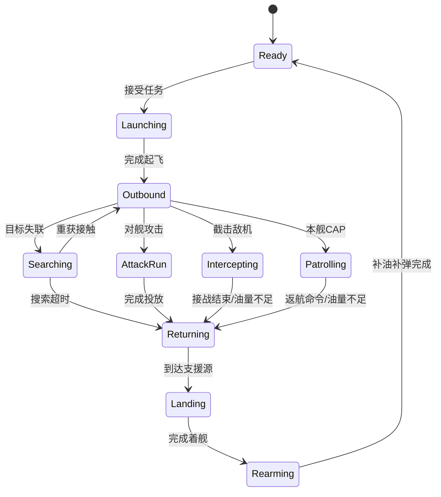

# 空战与舰队航空指挥设计

## 设计结论

本项目的航空玩法不是飞行模拟。玩家始终是舰长，只能签发任务意图；机群 AI 独立完成起飞、编队、航路飞行、接敌角度、武器释放、规避、返航与补给。游戏不提供飞机油门、转向、俯仰、投弹准星或单架飞机视角。

现有 15 个舰级全部是驱逐舰、轻巡洋舰和战列舰。第一阶段使用从地图边缘进入的“舰队航空支援队”，避免让非航母舰艇凭空携带攻击机。后续加入真实航母时，只把支援来源替换为航母机库、甲板和升降机，任务命令与机群 AI 不需要推倒重做。

## 从《战舰世界》借鉴什么

| 机制 | 借鉴 | 本项目调整 |
| --- | --- | --- |
| 机种职责 | 战斗机、鱼雷轰炸机、俯冲轰炸机分工明确 | 保留职责，不允许玩家亲自驾驶 |
| 出击循环 | 出击、攻击、返航、补充飞机与重新整备 | 改成机群 AI 状态机，损失和整备时间持续存在 |
| 战斗机 | 自动接战，巡逻机可被派往战术区域 | 直接成为可下令截击或本舰 CAP 的独立机群 |
| 防空 | 远/中/近程持续伤害、爆发弹幕与重点方向 | 不逐发模拟防空炮弹；固定步长结算持续伤害和少量可见弹幕 |
| 航空侦察 | 当前版本持续削弱无意侦察，战斗机不再提供水面点亮 | 战斗机完全不侦察舰船；攻击机只回传粗略、延迟接触 |
| 战术地图 | 巡逻战斗机可派往地图选定区域 | 所有航空命令均在战术地图完成 |

不照搬的部分是《战舰世界》当前由玩家直接控制攻击机群和投弹窗口的玩法；这与本项目“驾驶战舰、指挥航空队”的目标冲突。

## 玩家命令

按 `3` 进入航空指挥模式，大地图展开并显示己方机群卡片、有效目标、航线和 CAP 圈。玩家选择机群与任务后点击目标，再按 `Space` 确认。`Esc` 退出指挥界面但不撤销任务。

| 命令 | 合法机群 | 目标 | AI 行为 |
| --- | --- | --- | --- |
| 对舰攻击 | 鱼雷机、俯冲轰炸机 | 已稳定发现的敌舰 | 自选航路和攻击角度，完成一次攻击后返航 |
| 截击机群 | 战斗机 | 已发现的敌方机群 | 计算提前截击点，接战至脱离、弹药不足或油量不足 |
| 防御本舰 | 战斗机 | 无需选择 | 在本舰周围建立 CAP，自动截击进入警戒区的敌机 |
| 返航 | 所有在空机群 | 无需选择 | 中断可取消阶段并返航；进入攻击航线或着舰阶段后暂时锁定 |

途中可以改派，但攻击航线和着舰进近属于锁定阶段。敌舰接触丢失后，攻击机会在最后已知区域搜索 12 秒；无法重获就自行返航，不读取敌舰真实位置。

## AI 状态机

玩家命令中没有飞机的航向、速度、高度或投弹时机字段，从数据结构上阻止直接驾驶。

机群状态分别记录指挥舰与回收来源；目前回收来源是地图边缘的舰队航空基地，未来航母加入后可切换为航母实体。命令端也不能提交可信坐标，目标最后位置必须由战斗感知层生成。
重复提交相同命令是幂等操作，不会跳过起飞、反复重置任务计时或刷出事件；燃油进入返航预留时自动返航，回收前耗尽则迫降损失。

## 机种 AI

### 战斗机

- 截击时预测目标机群航向与速度，不追逐不可见机群。
- CAP 以本舰为移动中心，在警戒半径内选择威胁度最高的来袭机群。
- 战斗机不点亮舰船，避免航空队变成无风险全图雷达。
- 空战按双方飞机数、性能、队形完整度、先手位置和持续时间结算，不逐发生成机枪弹。

### 鱼雷轰炸机

- 优先争取目标侧舷；目标转向会迫使机群延长航路或接受较差投放角。
- 航空鱼雷拥有入水、武装距离、航速、射程与进水概率，但不会复用舰载鱼雷发射器状态。
- 首轮不进入可玩垂直切片，等防空与俯冲轰炸闭环稳定后接入。

### 俯冲轰炸机

- 优先沿敌舰艏艉方向进入，降低横向散布。
- 命中率由机群队形、剩余飞机、AA 压力、目标机动和天气共同决定。
- 首个可玩版本用 HE 炸弹，复用现有起火、舱段、模块和可恢复血量管线。

## 自动防空

防空保持自动，玩家不瞄准防空炮。每艘舰由已安装的防空组件形成远、中、近三层防空圈：

- 持续伤害以 0.1 秒固定步长作用于一个机群级生命池。
- 远程双用途炮生成少量可见爆发弹幕；只有穿越预测弹幕区才承受高额伤害。
- 中近程炮提供稳定持续压制，降低机群队形完整度和攻击精度。
- 防空炮损伤、火控模块、人力、舰体姿态和多舰重叠共同影响输出。
- 不生成每一颗 20/40 mm 炮弹，保证普通电脑和大量机群下的帧率。

第一版由舰上 AI 自动强化来袭方向；以后可增加“左舷/右舷重点防空”舰长命令，但它不改变飞机由 AI 驾驶的原则。

## 侦察与公平性

- 机群只能攻击己方感知层确认的目标或最后已知区域。
- 战斗机不发现水面舰艇。
- 攻击机回传接触需要延迟，只有方位、粗略舰种和置信度，不回传精确耐久。
- 烟幕、云层和低空飞行会影响接触，但 AI 不读取被遮挡实体。
- 玩家和敌方 AI 使用相同的目标合法性、油量、损失、整备与防空规则。

## UI 与视觉

航空指挥以大地图为主，不切换到飞机相机：

- 机群卡显示角色、在空/可用飞机数、油量、弹药、队形、任务和预计到达时间。
- 地图显示计划航线、最后已知目标、CAP 圈、防空威胁估计与返航线。
- 3D 场景每个机群只绘制 3–5 架低模代理；HUD 数字表示真实飞机数。
- 远距离机群只显示图标和音效，不渲染单机、螺旋桨或机枪弹。

## 首个可玩垂直切片

1. 双方各有一支战斗机和一支俯冲轰炸机支援队，从地图边缘进入。
2. 接入四种玩家命令、敌方同规则航空指挥 AI、战术地图目标点选。
3. 接入舰级防空属性和现有防空装备；使用机群级持续伤害。
4. 加入低模编队、投弹、爆炸、防空弹幕、发动机和警报音效。
5. 海试模式提供静止舰、机动舰、来袭轰炸机和来袭战斗机预设。
6. 单独运行航空平衡报告；默认水面 500 局基准可关闭航空，避免掩盖炮雷回归。

## 已知但尚未决定

- 首艘真实航母选择轻型航母还是舰队航母。
- 单局允许同时在空的机群数量，以及能否排队多个任务。
- 攻击机是否回传水面接触、延迟多少、共享给哪些单位。
- 多舰防空圈叠加的上限与收益递减曲线。
- 航空损失在单局内补充到什么程度，是否需要永久机库库存。
- 鼠标点选与键盘快速命令的最终交互细节。

## 尚不可完全预见的风险

- 多支机群在地图边缘、返航点和同一目标附近产生拥堵或反复改道。
- 机群 AI 为规避防空而生成玩家难以理解的长航线。
- 防空叠加导致攻击机“瞬间消失”，或反过来让单舰防空毫无作用。
- 水面目标在投弹前失联时，视觉、伤害与感知状态不同步。
- 大地图指挥、舰船操纵和瞄准模式之间出现输入焦点冲突。
- 低模编队在近距离看起来过于重复，需要在性能与观感之间重新分层。

## 参考

- World of Warships 2026 Roadmap — Aircraft Carriers and AA Mechanics: https://worldofwarships.com/en/news/general-news/roadmap-2026/
- World of Warships Wiki — Aircraft: https://wiki.worldofwarships.com/Ship%3AAircraft
- World of Warships Wiki — Anti-Aircraft Fire: https://wiki.worldofwarships.com/Ship%3AAnti-Aircraft_Fire
- World of Warships Wiki — Update 15.2 Patrol Fighter Changes: https://wiki.worldofwarships.com/Ship%3AUpdate_15.2
